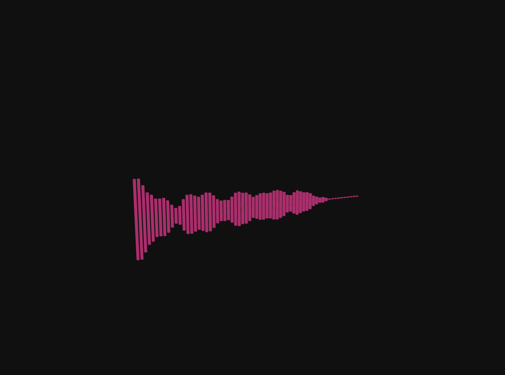

# 3주차 공유 내용



## AudioContext

- three.js에서 오디오를 처리하기 위한 가장 기본적인 요소 → Web Audio API의 `AudioContext`를 감싸고 있음
- 모든 오디오 노드의 생성과 실행을 관리하는 역할을 함
- 즉, 소리를 재생하고 조작하는 데 필요한 모든 작업이 일어나는 **오디오 처리 환경**

> 웹 오디오의 작업 흐름 방식
>
> 1. 오디오 컨텍스트를 생성
> 2. 컨텍스트 내에 소스를 생성(ex - <audio>, 발진기, 스트림)
> 3. 이펙트 노드 생성. (ex - 잔향 효과, 바이쿼드 필터, 패너, 컴프레서 등)
> 4. 오디오의 최종 목적지를 선택. (ex - 시스템 스피커)
> 5. 사운드를 이펙트에 연결하고, 이펙트를 목적지에 연결

> 일반적으로 개발자가 직접 `AudioContext`를 생성할 일은 많지 않음. `AudioListener`나 `AudioLoader`와 같은 다른 Three.js 오디오 객체를 생성하면 내부적으로 알아서 `AudioContext`를 설정해준다!

- `.getContext()`: 현재 사용 중인 `AudioContext`를 반환합니다. 만약 없다면 새로 생성합니다.
- `.setContext(value)`: 기존의 `AudioContext`를 새로운 `AudioContext`로 교체할 때 사용합니다.

## AudioListener

- `AudioListener`를 카메라에 연결하여 3D Scene 안에서 소리를 듣게 만들어줘야 함!
- Scene에 존재하는 모든 위치 기반(positional) 및 비위치 기반(non-positional) 오디오 효과를 듣기 위해 필요함..
  > _The AudioListener represents a virtual [listener](https://developer.mozilla.org/en-US/docs/Web/API/AudioListener) of the all positional and non-positional audio effects in the scene._
- `AudioListener` 인스턴스 생성하여, 보통 카메라의 자식으로 추가함

```jsx
const listener = new THREE.AudioListener()
camera.add(listener)
```

- ‼️ 카메라에 생성한 `AudioListener` 인스턴스를 추가하는 이유
  - 카메라의 움직임에 따라 위치와 방향도 함께 바뀌어, 소리를 현실감 있게 제어 가능
- 전역적인 오디오 제어 기능을 메서드로 제공
  - `setMasterVolume(value)`: 전체 오디오의 볼륨 조절~
  - `setFilter(value)` / `getFilter()` / `removeFilter()`: 전체 오디오에 필터 효과를 적용 혹은 제거

## Audio

- 위치에 영향을 받지 않는, 즉 **전역적인(non-positional) 소리를 재생**할 때 사용
- 배경 음악이나 효과음처럼 항상 동일한 볼륨으로 들리는 소리를 구현하는 데 적합
- ‼️ `Audio` 객체를 생성할 때는 반드시 `AudioListener` 인스턴스를 전달해야 함!

```jsx
const sound = new THREE.Audio(listener)

// AudioLoader를 사용해 사운드 파일을 불러오기
const audioLoader = new THREE.AudioLoader()
audioLoader.load('sounds/ambient.ogg', function (buffer) {
  sound.setBuffer(buffer)
  sound.setLoop(true) // 반복 재생 설정
  sound.setVolume(0.5) // 볼륨 설정
  sound.play() // 재생
})
```

## AudioAnalyser

- `AudioAnalyser`는 재생 중인 오디오의 주파수 및 시간 데이터를 분석하는 데 사용
- `AudioAnalyser`는 `Audio` 또는 `PositionalAudio` 객체와 `fftSize`라는 값을 인자로 받아 생성됩니다. `fftSize`는 주파수 분석의 정밀도를 결정하는 값입니다.

```jsx
const listener = new THREE.AudioListener()
camera.add(listener)

const sound = new THREE.Audio(listener)

const audioLoader = new THREE.AudioLoader()
audioLoader.load('sounds/ambient.ogg', function (buffer) {
  sound.setBuffer(buffer)
  sound.setLoop(true)
  sound.setVolume(0.5)
  sound.play()
})

const analyser = new THREE.AudioAnalyser(sound, 32) // default: 64

// 평균 주파수 값 가져오기
const data = analyser.getAverageFrequency()
```

- `getFrequencyData()`: 현재 오디오의 주파수 데이터를 배열 형태로 반환합니다.
- `getAverageFrequency()`: 주파수 데이터의 평균값을 반환

> `AudioContext`라는 큰 틀 안에,
> → `AudioListener`가 소리를 듣고,
> → `Audio`와 `PositionalAudio`가 각각 다른 방식으로 소리를 재생,
> → `AudioAnalyser`가 그 소리를 분석

---

## 3D 객체 복사: Instances와 Merged

> 드로우 콜(Draw Call)을 줄여 성능은 향상시키고 오브젝트 복사는 쉽게 해줌

- Instance: https://drei.docs.pmnd.rs/performances/instances
  - 동일한 객체를 대량으로 뿌리고 개별 제어가 필요하면 → Instances
- Merged: https://drei.docs.pmnd.rs/performances/merged#merged
  - 다양한 정적 객체들을 하나의 덩어리로 묶어 드로우 콜을 최소화하고 싶으면 → Merged
- Clone도 있긴 한데 이건 성능적으로 좋지 않다고 한다…
